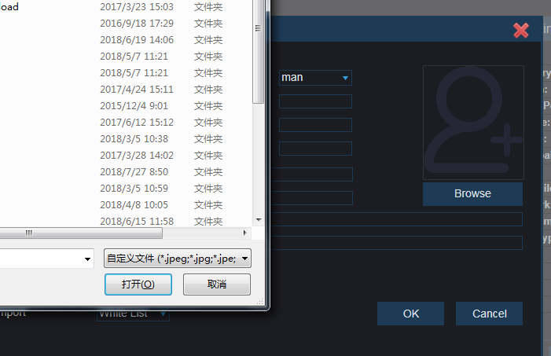

H5 FileReader选本地图片转base64（兼容IE8）

<h2>使用例子：</h2>

		图片容器 显示选中的图片
 		

			
 		

 
 
 		按钮点击选图
 		
click

		 <input onchange="imgChange(this)" type="file" id="getImgfile" accept="image/jpg,image/jpeg,image/gif,image/png" style="display:none"/>
		//不使用image/* 避免Chrome 下打开窗口缓慢		
		JS
		var imgChange = function(file) {
			if (file.files && file.files[0]) {
				var reader = new FileReader();
				reader.onload = function(evt) {
					$("#previewImg").prop("src",evt.target.result);
				};
				reader.readAsDataURL(file.files[0]);
			} else {//IE 8 can't use FileReader
				var realPath, xmlHttp, xml_dom, tmpNode, imgBase64Data;
				realPath = file.value;//get the image path
				xmlHttp = new ActiveXObject("MSXML2.XMLHTTP");
				xmlHttp.open("POST",realPath, false);
				xmlHttp.send("");
				xml_dom = new ActiveXObject("MSXML2.DOMDocument");
				tmpNode = xml_dom.createElement("tmpNode");
				tmpNode.dataType = "bin.base64";
				tmpNode.nodeTypedValue = xmlHttp.responseBody;
				imgBase64Data = "data:image/bmp;base64," + tmpNode.text.replace(/\n/g,"");
				$("#previewImg").prop("src",imgBase64Data);
			}
		};

		实现过程，点击click模拟按钮进而点击input弹出文件选择框，选择完成后调用imgChange函数
		

